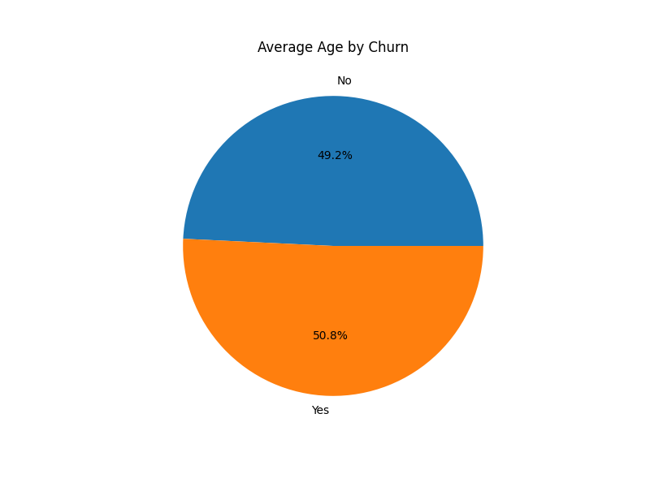
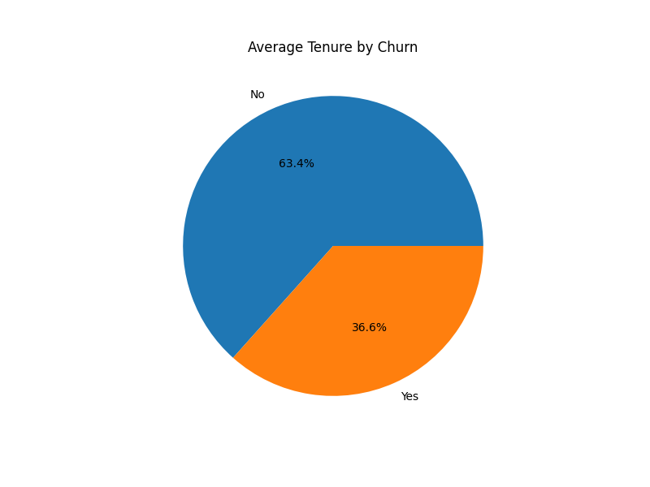
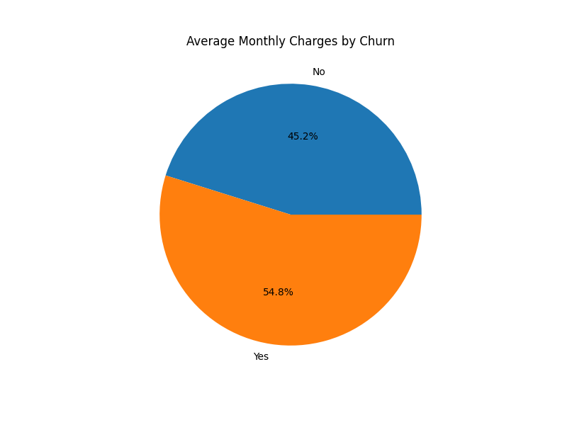

#  Churn Prediction Project

[]
[]
[]

---

##  Project Overview

Welcome to the **Churn Prediction Project**! 🚀 This is a full-stack **machine learning pipeline** aimed at predicting customer churn. Here's what makes it shine:

-  **Data Exploration & Visualization**: Dive deep into customer behavior through EDA.
-  **Modeling**: Train and compare multiple algorithms like Logistic Regression, Random Forests, and more.
-  **Deployment**: Experience live predictions via an elegant **Streamlit app**.
-  **Interpretability**: Gain insights into why customers churn and how to retain them.

---

##  Repository Structure

| Folder / File           | Description                                           |
|--------------------------|-------------------------------------------------------|
| `data/`                  | Raw and processed datasets                            |
| `notebooks/`             | Exploratory analysis and model-building notebooks     |
| `graphs/`                | Saved visualizations (ROC curves, confusion matrices) |
| `src/`                   | Preprocessing, model training, and evaluation code    |
| `models/`                | Serialized best-performing model(s) (`.pkl`)          |
| `app.py`                 | Streamlit application for interactive predictions     |
| `README.md`              | Project documentation (you're reading it!)             |
| `LICENSE`                | MIT License                                           |

---

##  Technology Stack

| Component              | Tools / Libraries                          |
|------------------------|---------------------------------------------|
| Programming Language   | Python 3.8+                                 |
| Data Handling          | Pandas, NumPy                               |
| Visualization          | Matplotlib, Seaborn, Plotly (optional)      |
| Machine Learning       | Scikit-learn, XGBoost, etc.                |
| Deployment             | Streamlit, Docker (optional)                |

---

##  Sample Model Performance Metrics

**Classification Report**

| Metric     | Score   |
|------------|---------|
| Accuracy   |  88%   |
| Precision  |  87%   |
| Recall     |  85%   |
| F1 Score   |  86%   |

***Age and Churn***




***Tenure and Chuen***




***Monthly Charges and Churn***





---

##  Business Context & Insights

Churn can significantly impact revenue. According to industry sources, acquiring a new customer costs up to **five times more** than retaining an existing one. To tackle churn effectively:

1. **Define churn** clearly (e.g., subscription cancellation or inactivity).
2. **Gather diverse data**: demographics, usage patterns, feedback.
3. **Preprocess wisely**: manage missing values, encode features, handle imbalances.
4. **Model & evaluate**: choose algorithms that balance accuracy and recall.
5. **Deploy & monitor** via tools like Streamlit for real-time predictions.

This project aims to blend **business value and technical rigour** seamlessly.

---

##  How to Use Locally

```bash
# Clone the Repository
git clone https://github.com/satyam951kr-ai/Churn-Prediction-Project.git
cd Churn-Prediction-Project

# Install Dependencies
pip install -r requirements.txt

# Run the Streamlit App
streamlit run app.py
